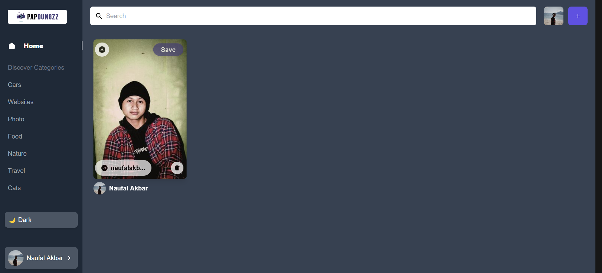

# PAPDUNGZZ

Create Social Media App with Reactjs and Sanity.io

## Screenshoot

<figure>
    
    

        <figcaption>Login Page.</figcaption>
    

</figure>

<figure>
    
    

        <figcaption>Dashboard Page.</figcaption>
    

</figure>

<figure>
    
    

        <figcaption>Details Page.</figcaption>
    

</figure>

<figure>
    
    

        <figcaption>User Profile Page.</figcaption>
    

</figure>

## Authors

Contributors names and contact info

Naufal Akbar Nugroho  
[@kbrnugroho](https://instagram.com/kbrnugroho)

## Version History

- 1.0.0
  - [Initial Release](CHANGELOG.md)